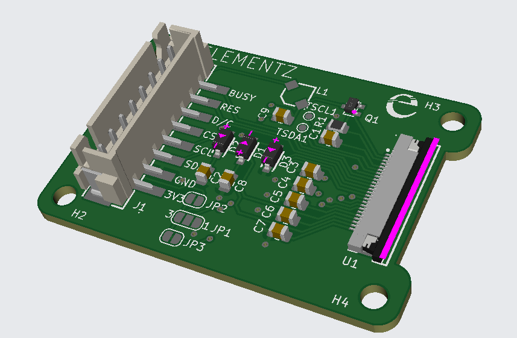

# E-Ink-E-Paper-Display
Sample codes and Documents for Elementz E-Paper display

## 1.54 Inch Adapter Board

## E-paper Display

| | |
|:---:|:---:|
 | 
 | 

### Dependencies
- Arduino Libraries
  - [Adafruit EPD](https://github.com/adafruit/Adafruit_EPD) @ ^4.4.4
  - [Adafruit GFX Library](https://github.com/adafruit/Adafruit-GFX-Library) @ ^1.11.2
  - [Adafruit BusIO](https://github.com/adafruit/Adafruit_BusIO) @ ^1.11.6
  
  
  
* Website: [ElementzOnline](https://elementzonline.com)
* Blog: [ElementzOnline Blog](https://www.elementzonline.com/blog/elementzonline-154-inch-epaper-display-tricolour-esp32)
* Video: [Demo Video](https://www.youtube.com/watch?v=Ye-CtWMQxFQ&ab_channel=ElementzEngineersGuild)
